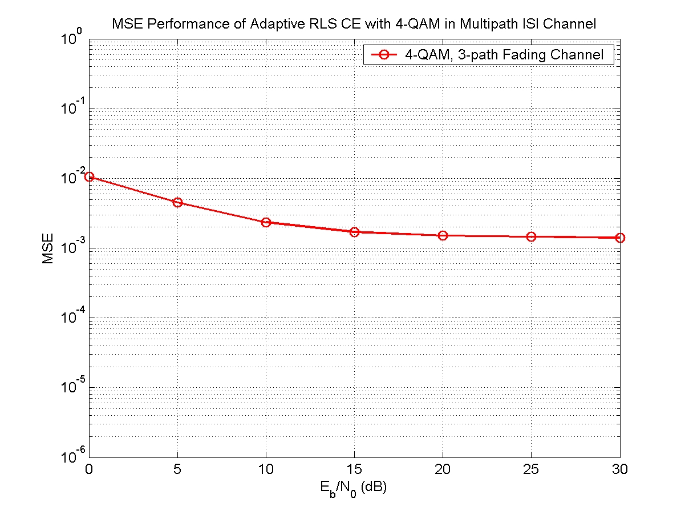

### Adpative RLS Channel Estimator (System Identifier)

This project implement an adaptive RLS (Recursive Least Squares) channel estimtor.

#### Simulated Channel
* Static ISI Channel: Proakis B Channel {0.407,0.815,0.407}
* Multipath fading channel: Jakes model {0.577, 0.577, 0.577}

